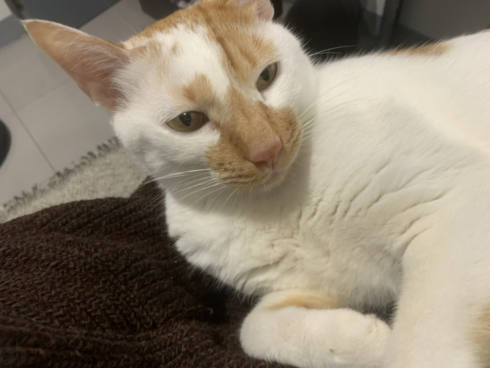

## 🥷About me
Hi! My name is Jun-Kai — fully immersed in **AI Research** and **Computer Vision**.  
> Coding in neon, dreaming in 3D.

### *Deep learning and Computer Vision*  

📄 Recently presented **Syn3DTxt** at **CVPR 2025 SyntaGen Workshop**  
(📑 [arXiv: Syn3DTxt: Embedding 3D Cues for Scene Text Generation](https://arxiv.org/abs/2505.18479))

**Hashtags:** `#Syn3DTxt` `#SceneTextGeneration` `#3DCues` `#CVPR2025Workshop` `#ComputerVision` `#SyntheticData`

---

##  Pinned Projects

| Project | Description |
|---------|-------------|
| **[Syn3DTxt Visualizer](https://github.com/KaiCobra/Syn3DTxt_visualizer)** | 可視化工具，將 Syn3DTxt 所學的 3D cues 用於場景文字生成視覺呈現（CVPR SyntaGen Workshop）|

---

## ─ Tech & Tools ─  

| AI & Computer Vision | Programming Languages | Tools & Platforms |
|----------------------|-----------------------|-------------------|
| **VAR** / **Diffusion Models** / **Synthetic Data** | **Python** / **C++** / **LaTeX** | **PyTorch** / **GitHub Actions** / **Streamlit** |

